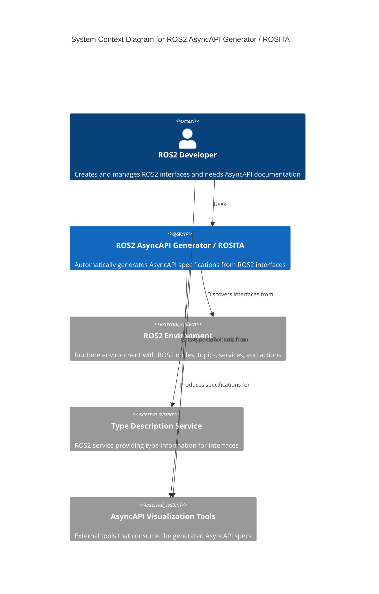
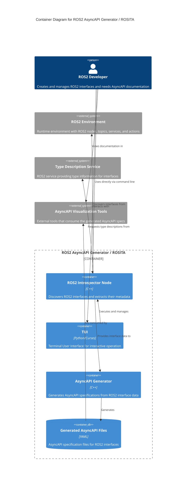
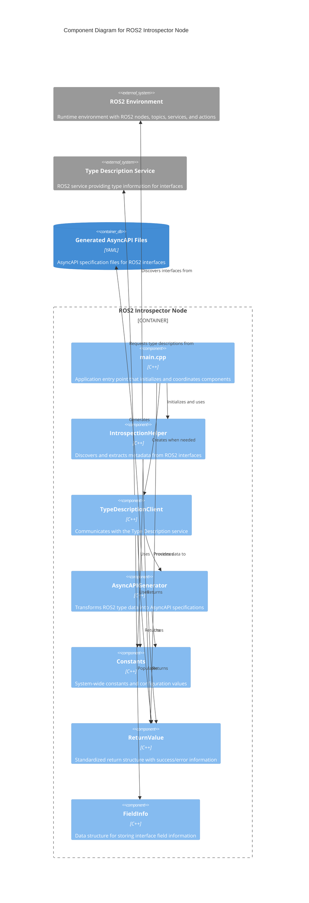
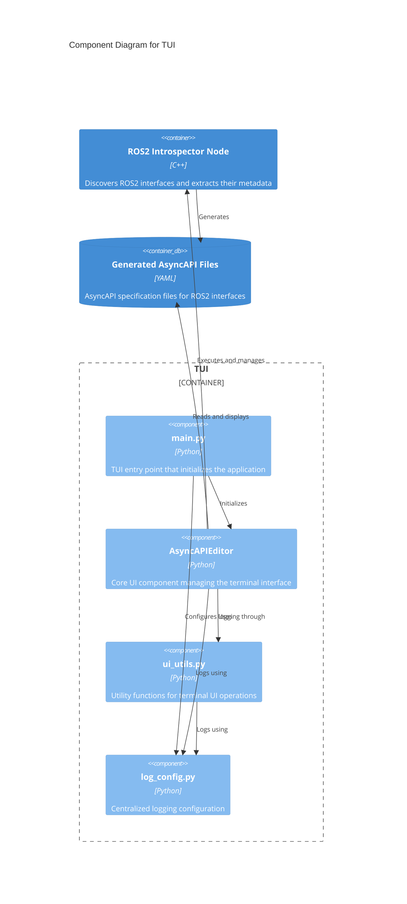
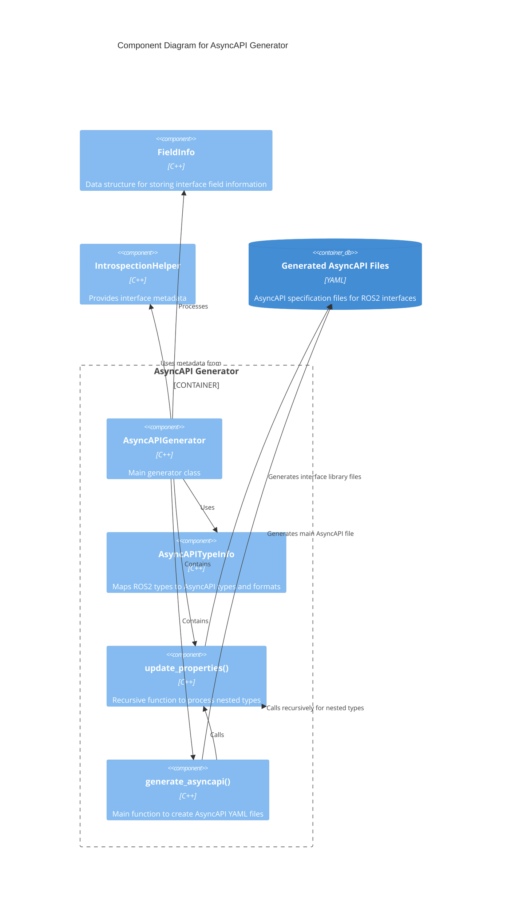

<p align="center">
  
</p>

<p align="center">
  ROSITA (ROS Siemens Introspection Tool for AsyncAPI) is a tool to create the ROS AsyncAPI specification for any interface that is currently used in your runtime system. You could add in one specification as many interfaces as you want. As it is a runtime tool, you will need to have a publisher/subscriber/server/client node of the interface to be able to use the introspection tool to obtain the structue of the interface.
</p>
<p></p>

<hr>

**Table of Contents**
  - [Overview](#overview)
  - [ROS Compatibility](#ros-compatibility)
  - [Features](#features)
    - [Terminal User Interface](#terminal-user-interface)
    - [ROS 2 Introspection (ros2_introspector_node)](#ros-2-introspection-ros2_introspector_node)
  - [C4 Model Architecture](#c4-model-architecture)
    - [C1: System Context Diagram](#c1-system-context-diagram)
    - [C2: Container Diagram](#c2-container-diagram)
    - [C3: Component Diagram (ROS 2 Introspector Node)](#c3-component-diagram-ros-2-introspector-node)
    - [C3: Component Diagram (TUI)](#c3-component-diagram-tui)
    - [C3: Component Diagram (AsyncAPI Generator)](#c3-component-diagram-asyncapi-generator)
  - [Installation](#installation)
    - [Using docker](#using-docker)
    - [Natively](#natively)
  - [Getting started](#getting-started)
  - [Usage](#usage)
    - [Configuration File](#configuration-file)
    - [Starting the Terminal UI](#starting-the-terminal-ui)
    - [Navigation](#navigation)
    - [Workflow](#workflow)
    - [Using `ros2_introspector_node` Directly](#using-ros2_introspector_node-directly)
  - [Configuration](#configuration)
    - [ROS 2 parameters](#ros-2-parameters)
    - [Output Files](#output-files)
  - [Usage of the AsyncAPI Documentation](#usage-of-the-asyncapi-documentation)
  - [Further development](#further-development)
  - [Maintainers](#maintainers)

## Overview
This repository provides a user-friendly terminal interface to generate, view, and manage AsyncAPI definitions from ROS 2 interfaces (topics, services, and actions). It integrates with the `ros2_introspector` package to introspect ROS 2 systems and generate corresponding AsyncAPI documents.


## ROS Compatibility

| ROS Distribution | Support Status | Notes |
|------------------|---------------|-------|
| ROS 2 Jazzy     | ✅ Full       | Recommended version for new projects |
| ROS 2 Humble      | ❌ Not supported | HASH discovery not supported |
| ROS 1       | ❌ Not supported | Out of Scope |

## Features
### Terminal User Interface
- Channel Navigation: Browse and select channels with arrow keys
- Channel Management: Delete unwanted channels from the AsyncAPI definition
- Refresh Options:
    - Generate AsyncAPI for all available interfaces
    - Select specific interfaces (topics, services, or actions) to include
- Path Configuration: Set the ROS 2 installation path
- Debug Information: View detailed system and environment information
- Interactive Dialogs: Confirmation prompts, notifications, and input fields

### ROS 2 Introspection (ros2_introspector_node)
- Automatic Interface Discovery: Detects all available ROS 2 interfaces
- Selective Interface Processing: Generate AsyncAPI for specific interfaces
- Message Structure Analysis: Extracts message structure information
- Service Request/Response Mapping: Maps ROS 2 services to AsyncAPI operations
- Action Goal/Result/Feedback Mapping: Maps ROS 2 actions to AsyncAPI operations
- YAML Output: Generates standard AsyncAPI 3.x definitions

## C4 Model Architecture

### C1: System Context Diagram


### C2: Container Diagram


### C3: Component Diagram (ROS 2 Introspector Node)


### C3: Component Diagram (TUI)


### C3: Component Diagram (AsyncAPI Generator)



## Installation
### Using docker
The repository contains a `.devcontainer` folder so when opening the repository in VSCode, it will ask you directly to open it in a devcontainer with all the dependencies already installed.

### Natively
You will need to have installed:
- ROS 2 (jazzy or later)
- Python 3
- curses library (usually included with Python)
- libyaml-cpp-dev
- nlohmann-json3-dev

## Getting started
In this repository you will find two main folders: 
- ros2_introspector: node that makes all the calls to the service used to obtain the information of the topic. It also contains the source code to create the yaml files for the asyncAPI preview.
- TUI: it contains a Terminal UI to execute this tool in a more interactive way.

So you could decide to run directly the node or to use the terminal UI to obtain your AsyncAPI specification.

## Usage
Since Type Hash discovery for services and actions is yet [missing in Jazzy](https://github.com/ros2/rmw/issues/356), for actions and services the availability of the share folder is required to be able to check the hash. For that, if the action or the service that you want to obtain is from another workspace of from the default ROS 2 installation, you need to specify the path to the share directory in the ROS2 installation. 

### Configuration File
The path is automatically saved in a configuration file called `ros2_path_config.yaml` in the [TUI folder](./TUI/) for future use.
- Location: Same directory as the TUI script
- Format: Simple YAML with comments
- Default path: /opt/ros/jazzy/share/ if no custom path is set

> ⚠️ **Warning:** If you try to obtain the specification for actions or services without specifying the path when it is not the current workspace, you will obtain a segmentation fault.

### Starting the Terminal UI
```bash
cd ros2_ws                      # Go to your ros workspace
colcon build                    # To build the ros2_introspector node
source install/setup.bash
python3 TUI/main.py  # To run the TUI
```

### Navigation
- ↑/↓: Navigate through channels
- D: Delete the selected channel
- R: Refresh AsyncAPI definition
- I: Show debug information
- P: Configure ROS2 path
- Q: Exit the application

### Workflow
0. [Start the TUI](#starting-the-terminal-ui)
1. Configure ROS 2 Path: Press 'P' to set the path to your ROS 2 installation
2. Generate AsyncAPI: Press 'R' to refresh and select generation mode:
    - All interfaces: Automatically detect and process all available interfaces
    - Select interface: Choose a specific interface type and name
3. Browse Channels: Use arrow keys to navigate through the generated channels
4. Delete Unwanted Channels: Select a channel and press 'D' to remove it
5. Debug Issues: Press 'I' to view system information and logs

### Using `ros2_introspector_node` Directly
The node can also be run directly using ROS 2 parameters without using the TUI:
```bash
# Generate for all interfaces
ros2 run ros2_introspector ros2_introspector_node --ros-args --param mode:=all --param ros2_path:=/opt/ros/jazzy/share/

# Generate for specific interface
ros2 run ros2_introspector ros2_introspector_node --ros-args \
  --param mode:=select \
  --param interface_type:=msg \
  --param selected_interface:=/your/topic/name \
  --param ros2_path:=/opt/ros/jazzy/share/

# Run interactive mode (will prompt for inputs)
ros2 run ros2_introspector ros2_introspector_node --ros-args --param ros2_path:=/opt/ros/jazzy/share/
```

## Configuration
### ROS 2 parameters
The following ROS 2 parameters control the behavior of the introspection tool:
- mode: Introspection mode ("all" or "select")
- interface_type: Type of interface when in select mode ("msg", "srv", or "action")
- selected_interface: Name of the interface when in select mode
- ros2_path: Path to the ROS2 installation share directory

### Output Files
After running the package, a new folder called output will be created. 

Inside it you will find two items:
- Head Document: that contains the header asyncapi file
- InterfaceLibrary folder: that contains all the ayncapi definitions of the different interfaces.

Once that you obtain the .yaml files you could create a markdown with all the information by using the official asyncapi generator. For that, first you need to install the asyncapi generator by:
```
npm install -g @asyncapi/cli
```

Then you will be able to generate the markdown automatically:
```
asyncapi generate fromTemplate <asyncapi.yaml> @asyncapi/markdown-template@1.6.7
```

You could find [here](./example/asyncapi.md) an example of the generated markdown file.

You are able to generate also the html page with all the information:
```
asyncapi generate fromTemplate <asyncapi.yaml> -o ./html @asyncapi/html-template@3.0.0 --use-new-generator
```

You could find [here](./example/html) an example of the generated files for the html web page.

## Usage of the AsyncAPI Documentation
The document could be used as a standard documentation of your ROS 2 topics, but it is also really useful to generate code from the specification. For example, having the definition, you could be able to generate ROS 2 nodes based on a template, low-code tools, etc.

## Further development

> ⚠️ **Warning:** Since Type Hash discovery for services and actions is yet missing in Jazzy, the benefit of using this tool when there is no access to the code only works for messages. For actions and services the availability of the install folder is required to be able to check the hash.

## License

This project is licensed under the [Apache License](LICENSE.md).

## Maintainers
Refer to [Maintainers](MAINTAINERS.md)

---


<br clear="all"/>


This Communication is part of a project that has received funding from the European Union’s Horizon Europe research and innovation programme under grant agreement Nº101069732

---
© Siemens AG, 2024
